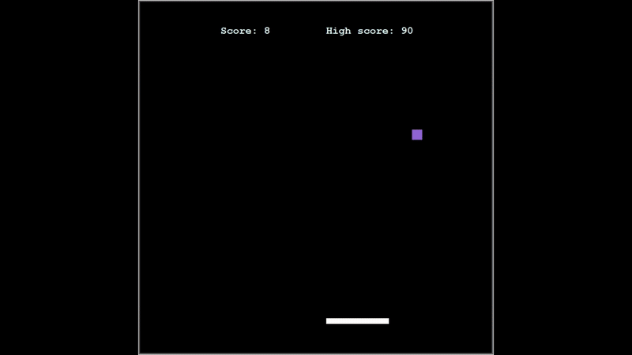
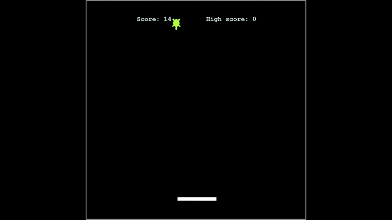

# 🎮 Hungry Shapes

**Hungry Shapes** is a fast-paced reflex-based arcade game built with Python's Turtle module. Control a paddle to catch falling shapes — some will boost your score, some will end your game instantly!  

---

## 📸 Game Preview

> 📝 Two different moments from gameplay

---

---

## 🕹️ Gameplay Features

- Move the paddle left and right using arrow keys.
- Catch colorful shapes to gain points:
  - ⚫ Circle = +1 point
  - 🟩 Square = +2 points  
  - 🐢 Turtle = +3 points  
  - 🔺 Triangle = Resets your score  
  -  White shape = Instant game over  
- The game becomes more challenging as your score increases.
- High score is saved and displayed.

---

## 📂 File Structure

- `main.py`: The main game loop and shape management  
- `paddle.py`: Controls the paddle's movement  
- `shapes.py`: Handles falling shapes, sizes, colors, and random behavior  
- `score.py`: Score tracking and high score logic  
- `highscore.txt`: Stores the highest score between sessions 

---

## How to Run

1. Make sure you have Python installed.
2. Run `main.py` from any Python IDE or terminal.
